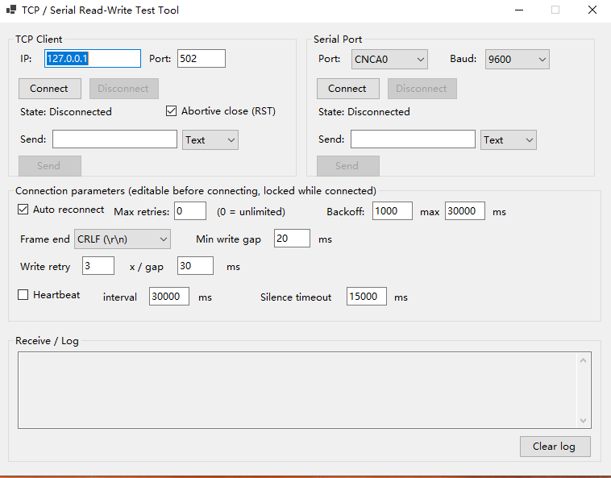

# TcpSerialComm — Industrial-Grade .NET TCP / Serial Port Communication Classes

A self-contained, migration-ready communication layer for industrial equipment (PLCs, barcode scanners,
instruments, vision controllers, scales, printers). It provides two drop-in classes with identical calling
conventions — `TcpCommunicator` and `SerialPortCommunicator` — plus a minimal WinForms harness used to
exercise read/write and reconnection behavior.

The library has **no dependency on WinForms or WPF**; events are marshalled back to the UI thread through
`SynchronizationContext`, so the same classes can be reused verbatim in WPF applications, Windows services,
console tools or background jobs.

---

## Table of Contents

1. [Screenshots](#screenshots)
2. [Key Features](#1-key-features)
3. [Requirements](#2-requirements)
4. [Repository Layout](#3-repository-layout)
5. [Class Reference](#4-class-reference)
6. [Quick Start](#5-quick-start)
7. [Configuration Reference](#6-configuration-reference)
8. [Reading Data: The Dual-Channel Model](#7-reading-data-the-dual-channel-model)
9. [Framing: Solving Coalescing and Fragmentation](#8-framing-solving-coalescing-and-fragmentation)
10. [Disconnection Detection and Auto-Reconnect](#9-disconnection-detection-and-auto-reconnect)
11. [Heartbeat and Watchdog](#10-heartbeat-and-watchdog)
12. [Thread Safety and Resource Management](#11-thread-safety-and-resource-management)
13. [Design Decisions](#12-design-decisions)
14. [Safety Rules Implemented](#13-safety-rules-implemented)
15. [WinForms Test Harness](#14-winforms-test-harness)
16. [Known Limitations and Extension Points](#15-known-limitations-and-extension-points)
17. [Build and Run](#16-build-and-run)
18. [Documentation Maintenance Policy](#17-documentation-maintenance-policy)

---

## Screenshots

> Screenshot files live next to this README and are committed together with the source code.

### Main window — TCP client and serial port in one shell



---

## 1. Key Features

| Capability | Description |
|---|---|
| **Asynchronous API** | `OpenAsync` / `CloseAsync` / `WriteAsync` / `ReadAsync` are all genuinely asynchronous (`async`/`await` + `CancellationToken`) and never block the UI thread. |
| **Disconnection detection** | Never trusts the cached `TcpClient.Connected` value. Disconnection is detected via read failure, a zero-byte read, or the heartbeat watchdog. |
| **Auto-reconnect** | Exponential backoff with jitter, capped at a configurable ceiling, unlimited or bounded by attempt count. |
| **Dual-channel read** | Push mode (`DataReceived` event) and pull mode (`ReadAsync`) coexist; inbound frames are delivered to whichever consumer is active. |
| **Framing** | Delimiter-based, 2-byte little-endian length prefix, or raw pass-through — solves packet coalescing (`AA` + `BB` arriving as `AABB`) and fragmentation (`AABB` arriving as `AA` then `BB`). |
| **Heartbeat watchdog** | Optional periodic keep-alive plus silence-based link-death detection. |
| **Write protection** | `SemaphoreSlim` write lock, minimum inter-write spacing, and configurable retry with interval — prevents packet coalescing on the wire. |
| **Selectable close mode** | `TcpCloseMode.Graceful` (FIN handshake) or `TcpCloseMode.Abortive` (RST, frees the peer's connection slot immediately) via `TcpCommunicatorConfig.CloseMode`. |
| **Resource safety** | All unmanaged resources (`TcpClient`, `NetworkStream`, `SerialPort`, `CancellationTokenSource`, `Timer`) are disposed deterministically; close paths cannot hang indefinitely. |
| **UI-framework agnostic** | No WinForms/WPF reference; `SynchronizationContext` support for thread-safe UI updates. |
| **Defensive by design** | Atomic open-claim (no double-connect race), volatile cross-thread flags, bounded receive buffer, null-safe conversions. |

---

## 2. Requirements

| Item | Value |
|---|---|
| Target framework | `net8.0-windows` (the communication classes themselves require only `net8.0`; the WinForms harness needs `-windows`) |
| Language version | `latest` |
| NuGet package | `System.IO.Ports` 8.0.0 (required for the serial class; already included by the Windows Desktop runtime, referenced explicitly for reliable restore) |
| Platform | Windows (serial port support); TCP class is platform-agnostic |

---

## 3. Repository Layout

```
TcpSerialComm/
├─ TcpSerialComm.csproj              Project file (net8.0-windows, WinForms)
├─ Program.cs                       Entry point, single-instance Mutex guard
├─ MainForm.cs                      WinForms test harness (UI text fully in English)
├─ README.md                        This document
├─ TCPClientAndComTool.png          Screenshot of the test harness (referenced by this README)
├─ Communicators/                   ← the reusable library
│  ├─ ICommunicator.cs              Unified interface for both classes
│  ├─ TcpCommunicator.cs            TCP read/write class (core)
│  ├─ SerialPortCommunicator.cs     Serial read/write class (mirrors the TCP design)
│  ├─ CommunicatorConfig.cs         Shared + per-transport configuration, FramingMode / TcpCloseMode enums
│  ├─ ConnectionState.cs            State machine enum
│  ├─ CommunicatorEventArgs.cs      Event payload types
│  └─ FrameBuilder.cs               Inbound frame assembler (internal)
└─ Common/                          ← shared helpers, reusable in any project
   ├─ ByteArrayConverter.cs         byte[] ⇄ text ⇄ hex conversion
   ├─ Guard.cs                      Defensive argument validation
   └─ RetryHelper.cs                Generic cancellable retry helper
```

To migrate into a new project, copy `Communicators/` and `Common/` — nothing else is required.

---

## 4. Class Reference

### `ICommunicator`

The unified contract implemented by both transports, so calling code does not care which one is in use.

```csharp
public interface ICommunicator : IDisposable
{
    ConnectionState State { get; }
    bool IsConnected { get; }

    event EventHandler<ConnectionStateChangedEventArgs> StateChanged;
    event EventHandler<DataReceivedEventArgs>          DataReceived;   // push mode
    event EventHandler<CommunicatorErrorEventArgs>     Error;

    Task OpenAsync(CancellationToken ct = default);
    Task CloseAsync(CancellationToken ct = default);
    Task<bool> WriteAsync(byte[] data, CancellationToken ct = default);
    Task<byte[]> ReadAsync(CancellationToken ct = default);           // pull mode
}
```

### `TcpCommunicator`

| Member | Description |
|---|---|
| `TcpCommunicator(TcpCommunicatorConfig config)` | Constructor. `Host` is validated as non-empty. |
| `Config` | The live `TcpCommunicatorConfig` instance (mutate before `OpenAsync`). |
| `SyncContext` | Assign `SynchronizationContext.Current` in a UI app so all events arrive on the UI thread. |
| `State` / `IsConnected` | Current `ConnectionState`; `IsConnected` is true only when fully connected. |
| `OpenAsync` | Opens the connection. Rejects concurrent/repeated opens. On failure with `AutoReconnect` enabled, starts the reconnect loop instead of throwing. |
| `CloseAsync` | Stops the heartbeat, cancels the read/reconnect loops, releases the stream, and wakes pending readers. Idempotent. |
| `WriteAsync` | Thread-safe write with framing, minimum spacing, and retry. Returns `false` on failure (never throws for transport errors). |
| `ReadAsync` | Awaits the next complete frame (request-response pattern). Returns `null` on cancellation or when not connected. |
| `DataReceived` | Raised for every complete frame when no `ReadAsync` caller is waiting. |
| `StateChanged` | Raised on every state transition, carrying the human-readable reason in `Message`. |
| `Error` | Raised with the failed `Operation` name (`Connect`, `Read`, `Write`, `Heartbeat`, `KeepAlive`, …). |
| `Dispose` | Closes the connection (max 2 s) and releases every managed resource. Idempotent. |

### `SerialPortCommunicator`

Same public surface as `TcpCommunicator`, backed by `SerialPortCommunicatorConfig`. Two behavioral
differences worth knowing:

* It reads through `SerialPort.BaseStream.ReadAsync` rather than the `DataReceived` event, because that
  event is unreliable on several .NET versions (it can drop or interleave data).
* `PortName` is intentionally **not** validated at construction time, so the port can be chosen at runtime
  from a combo box just before opening.

### `ConnectionState`

```
Disconnected ──► Connecting ──► Connected
      ▲               │             │
      │               ▼             ▼
      │        Reconnecting ◄── (link lost, AutoReconnect on)
      │               │
      └──── Disconnecting ──────────┘        Error (terminal failure state)
```

### `CommunicatorEventArgs`

| Type | Payload |
|---|---|
| `DataReceivedEventArgs` | `Data` (`byte[]`, never null), `Timestamp` (`DateTime.Now`) |
| `ConnectionStateChangedEventArgs` | `OldState`, `NewState`, `Message` |
| `CommunicatorErrorEventArgs` | `Exception`, `Operation` (never null) |

### `Common` helpers

| Class | Methods |
|---|---|
| `ByteArrayConverter` | `FromText(string, Encoding = UTF8)`, `ToText(byte[], Encoding = UTF8)`, `FromHex(string)`, `ToHex(byte[], string separator = " ")` |
| `Guard` | `ArgumentNotNull`, `ArgumentNotNullOrEmpty`, `InRange(int/long, min, max, paramName)` |
| `RetryHelper` | `RetryAsync<T>(Func<Task<T>>, int retryCount, int intervalMs, CancellationToken)` and a non-generic overload |

`ByteArrayConverter.FromHex` accepts `"AA BB CC"`, `"AABBCC"`, `"AA-BB"`, `"AA,BB"` and `"AA:BB"`
(separators optional) and throws `FormatException` on invalid characters or an odd number of digits.

---

## 5. Quick Start

### 5.1 TCP

```csharp
using TcpSerialComm.Communicators;
using TcpSerialComm.Common;
using System.Text;

var cfg = new TcpCommunicatorConfig
{
    Host = "192.168.1.10",
    Port = 502,
    Framing = FramingMode.Delimiter,           // one message ends with CRLF (default)
    AutoReconnect = true,
    MaxReconnectAttempts = 0,                  // 0 = unlimited
};

using var comm = new TcpCommunicator(cfg);
comm.SyncContext = SynchronizationContext.Current;   // omit in a console/service app

// Push mode: unsolicited data from the device.
comm.DataReceived += (s, e) => Console.WriteLine("RX: " + ByteArrayConverter.ToText(e.Data));

// Observe state transitions and errors.
comm.StateChanged += (s, e) => Console.WriteLine($"{e.OldState} -> {e.NewState} {e.Message}");
comm.Error        += (s, e) => Console.WriteLine($"ERR [{e.Operation}] {e.Exception.Message}");

await comm.OpenAsync();

// Writes are framed automatically: "HELLO" goes out as "HELLO\r\n".
await comm.WriteAsync(Encoding.ASCII.GetBytes("HELLO"));

// Pull mode: send a command and wait for exactly one reply frame.
await comm.WriteAsync(Encoding.ASCII.GetBytes("READ?"));
byte[] reply = await comm.ReadAsync();        // null if disconnected / cancelled
if (reply != null) Console.WriteLine("Reply: " + ByteArrayConverter.ToText(reply));

await comm.CloseAsync();
```

### 5.2 Serial port

```csharp
using TcpSerialComm.Communicators;

var cfg = new SerialPortCommunicatorConfig
{
    PortName = "COM3",          // pick at runtime, e.g. SerialPort.GetPortNames()
    BaudRate = 115200,
    Parity   = System.IO.Ports.Parity.None,
    DataBits = 8,
    StopBits = System.IO.Ports.StopBits.One,
    Framing  = FramingMode.Delimiter,
};

using var comm = new SerialPortCommunicator(cfg);
comm.SyncContext = SynchronizationContext.Current;
comm.DataReceived += (s, e) => Console.WriteLine("RX: " + ByteArrayConverter.ToHex(e.Data));

await comm.OpenAsync();                        // pulling the cable triggers auto-reconnect
await comm.WriteAsync(Encoding.ASCII.GetBytes("AT\r\n"));   // AppendDelimiterOnWrite adds the terminator
await comm.CloseAsync();
```

### 5.3 Using the interface for transport-agnostic code

```csharp
ICommunicator comm = useSerial ? serialComm : tcpComm;   // caller decides the transport
await comm.OpenAsync();
await comm.WriteAsync(payload);
await comm.CloseAsync();
```

### 5.4 Length-prefixed (binary) protocol

```csharp
var cfg = new TcpCommunicatorConfig
{
    Host = "10.0.0.5",
    Port = 9000,
    Framing = FramingMode.LengthPrefix,   // a 2-byte little-endian length header is added automatically
};
// Payload {0x01,0x02,0x03} is transmitted as: 03 00 01 02 03
```

---

## 6. Configuration Reference

All properties live on `CommunicatorConfig` (shared) and its two subclasses. **Every option has a default
value**, so a valid configuration can be built by setting only the endpoint.

### 6.1 Shared (`CommunicatorConfig`)

| Property | Type | Default | Unit | Description |
|---|---|---|---|---|
| `AutoReconnect` | `bool` | `true` | — | Reconnect automatically after a disconnection. |
| `MaxReconnectAttempts` | `int` | `0` | attempts | `0` = unlimited reconnection. A positive value stops the loop once reached. |
| `ReconnectBaseDelayMs` | `int` | `1000` | ms | Base backoff delay; also the jitter range. |
| `ReconnectMaxDelayMs` | `int` | `30000` | ms | Ceiling for the backoff delay. |
| `Framing` | `FramingMode` | `Delimiter` | — | `Raw`, `Delimiter` or `LengthPrefix`. |
| `FrameDelimiter` | `byte[]` | `{ 0x0D, 0x0A }` (CRLF) | — | Frame terminator used when `Framing = Delimiter`. |
| `AppendDelimiterOnWrite` | `bool` | `true` | — | Append `FrameDelimiter` to outgoing payloads. Set `false` for raw/hex pass-through. |
| `ReceiveBufferSize` | `int` | `4096` | bytes | Size of the read buffer used by the read loop. |
| `MaxFrameBufferBytes` | `int` | `1048576` | bytes | Upper bound for the inbound framing buffer; `0` = unlimited. Protects against memory exhaustion when the peer never sends a terminator. |
| `HeartbeatEnabled` | `bool` | `false` | — | Enable the heartbeat sender and the silence watchdog. |
| `HeartbeatIntervalMs` | `int` | `30000` | ms | How often the heartbeat request is sent. |
| `HeartbeatSilenceTimeoutMs` | `int` | `15000` | ms | No data received for longer than this is treated as a dead link. |
| `HeartbeatRequest` | `byte[]` | `ASCII "PING"` | — | Heartbeat payload; framed automatically on send. |
| `WriteRetryCount` | `int` | `3` | attempts | Total write attempts before giving up. |
| `WriteRetryIntervalMs` | `int` | `30` | ms | Delay between write attempts. |
| `WriteMinIntervalMs` | `int` | `20` | ms | Minimum spacing between two writes (industrial convention: 20–50 ms) to prevent packet coalescing. |

### 6.2 TCP (`TcpCommunicatorConfig`)

| Property | Type | Default | Description |
|---|---|---|---|
| `Host` | `string` | `"127.0.0.1"` | Remote host or IP address. Must be non-empty (validated in the constructor). |
| `Port` | `int` | `502` | Remote TCP port. |
| `ConnectTimeoutMs` | `int` | `5000` | Connect timeout; implemented with a linked `CancellationTokenSource`. |
| `NoDelay` | `bool` | `true` | Disables Nagle's algorithm for lower latency. |
| `KeepAlive` | `bool` | `true` | Enables the OS-level TCP keep-alive probe. |
| `KeepAliveTimeSec` | `int` | `30` | Idle time before the first probe (the OS default of 2 hours is impractical). |
| `KeepAliveIntervalSec` | `int` | `10` | Interval between probes. |
| `KeepAliveRetryCount` | `int` | `3` | Failed probes before the connection is dropped. |
| `SendBufferSize` | `int` | `8192` | Socket send buffer size. |
| `CloseMode` | `TcpCloseMode` | `Abortive` | How the socket is torn down. `Graceful` = normal `Close()` (FIN handshake, pending data flushed); `Abortive` = RST (`LingerOption(true,0)` + `Close`) that frees the peer slot immediately. See §11. |

### 6.3 Serial port (`SerialPortCommunicatorConfig`)

| Property | Type | Default | Description |
|---|---|---|---|
| `PortName` | `string` | `""` | e.g. `"COM3"`. Must be set before `OpenAsync`; validated at open time, not at construction. |
| `BaudRate` | `int` | `9600` | Baud rate. |
| `Parity` | `Parity` | `None` | Parity mode. |
| `DataBits` | `int` | `8` | Data bits. |
| `StopBits` | `StopBits` | `One` | Stop bits. |
| `RtsEnable` | `bool` | `false` | Request-to-send line. |
| `DtrEnable` | `bool` | `false` | Data-terminal-ready line. |
| `ReadTimeout` | `int` | `0` | Kept for compatibility only — see the note below. |
| `WriteTimeout` | `int` | `0` | Synchronous write timeout (`0` = infinite). |

> **Note on serial timeouts.** `SerialPort.ReadTimeout` / `WriteTimeout` apply only to the synchronous
> `Read` / `Write` calls. This class reads via `BaseStream.ReadAsync`, so the read timeout has no effect
> on it. Disconnection is detected through stream failure and the watchdog instead, which is more reliable
> anyway.

---

## 7. Reading Data: The Dual-Channel Model

Inbound data can be consumed in two ways, and both are available simultaneously.

### Push mode — the `DataReceived` event

```csharp
comm.DataReceived += (s, e) => HandleFrame(e.Data);
```

Data is broadcast to every subscriber as soon as a complete frame arrives. Use this for devices that
report spontaneously (sensors, indicators, scales, vision controllers).

### Pull mode — `ReadAsync()`

```csharp
await comm.WriteAsync(command);
byte[] reply = await comm.ReadAsync(ct);
```

The caller awaits exactly one frame. Use this for command/response protocols.

### Dispatch rule

Each assembled frame is offered to the pull-mode waiters first:

```csharp
if (TryDispatchToWaiter(f)) continue;                 // a ReadAsync caller is waiting -> hand it over
Post(() => DataReceived?.Invoke(this, new DataReceivedEventArgs(data)));   // otherwise -> push event
```

* `_pendingReaders` is a FIFO queue of `TaskCompletionSource<byte[]>` guarded by its own lock, so the
  first caller to await is the first to be served.
* If no `ReadAsync` caller is waiting, the frame is broadcast through `DataReceived` instead — the two
  modes never duplicate a frame.
* Cancelling a `ReadAsync` call removes its entry from the queue, so nothing leaks.
* When the state leaves `Connected` (disconnection, close, dispose), every pending waiter is woken and
  receives `null`. A request/response caller therefore cannot hang forever on a dead link.

---

## 8. Framing: Solving Coalescing and Fragmentation

Byte streams have no message boundaries. Two commands written back-to-back may arrive merged
(`"AA" + "BB"` → `"AABB"`), or one message may arrive split (`"AABB"` → `"AA"`, then `"BB"`). Framing
defines where a message ends. `FrameBuilder` (inbound) and `CommunicatorConfig.BuildSendPayload`
(outbound) are exact mirrors of each other, so the send and receive sides always agree.

| `FramingMode` | Wire format | Inbound rule | Outbound rule |
|---|---|---|---|
| `Delimiter` | `HELLO\r\n` | Emit everything up to and excluding the delimiter | Append `FrameDelimiter` when `AppendDelimiterOnWrite` is true |
| `LengthPrefix` | `06 00 48 45 4C 4C 4F 21` | Read the 2-byte little-endian length, then that many bytes | Prepend a 2-byte little-endian length header |
| `Raw` | `HELLO` | Emit whatever was read, immediately | Send as-is |

**A note on line protocols.** With the defaults (`Delimiter` + CRLF), writing `"HELLO"` puts `"HELLO\r\n"`
on the wire, and the inbound frame handed to your code contains `"HELLO"` — the terminator has already
been stripped. Switching the combo box to `LF` or `None` changes this behavior at runtime; `None` maps
to `Raw`.

**Malformed-stream protection.** In `Delimiter` and `LengthPrefix` mode, a peer that never terminates a
frame would grow `_buffer` without limit. Once the buffer exceeds `MaxFrameBufferBytes` (default 1 MB) it
is cleared and reset, trading one lost frame for protection against an out-of-memory condition.

---

## 9. Disconnection Detection and Auto-Reconnect

### 9.1 How a disconnection is detected

Three independent signals, none of which relies on the cached `TcpClient.Connected` property (which stays
`true` long after the peer has gone away):

1. **Read failure** — `ReadAsync` on the socket throws (connection reset, cable pulled, adapter disabled).
2. **Zero-byte read** — the peer performed a graceful shutdown; the loop logs a `Read` error and exits.
3. **Heartbeat watchdog** — no bytes received within `HeartbeatSilenceTimeoutMs` while `HeartbeatEnabled`
   is true. This catches "half-open" links where the peer is silent but the socket still looks alive.

As soon as any of these fires, the read loop ends, `SetState` wakes all pending `ReadAsync` waiters, and
the reconnect loop is started (when `AutoReconnect` is true).

### 9.2 Backoff strategy

```
delay = min(ReconnectBaseDelayMs * 2^attempt, ReconnectMaxDelayMs) + jitter
jitter = random(0, ReconnectBaseDelayMs)
```

With the defaults (base 1000 ms, max 30000 ms) the delay grows `1s → 2s → 4s → 8s → 16s → 30s → 30s …`,
with jitter added to avoid a thundering-herd effect when several clients reconnect at once.
`MaxReconnectAttempts = 0` means the loop retries indefinitely; the loop is cancelled immediately by
`CloseAsync`/`Dispose`, so it never blocks shutdown.

### 9.3 State notifications

Every transition is published through `StateChanged` and mirrored in `Message`, for example:

```
Connecting -> Connected
Connected -> Disconnected (Connection lost (peer closed or read error).)   # read loop detected a dead link
Disconnected -> Reconnecting (Starting automatic reconnect (unlimited retries).)
Reconnecting -> Reconnecting (Reconnect failed (attempt 3, retrying in 4000 ms).)
Reconnecting -> Connected (Reconnected successfully.)                       # peer came back, link restored
Connected -> Disconnected (Read loop ended.)                                 # AutoReconnect off
```

> **Design note:** a lost link first moves to `Disconnected` (which releases any caller blocked in
> `ReadAsync`) and *then* to `Reconnecting`. The reconnect entry point therefore does not reject a pending
> state of `Connected` — the read/write loops flag the link down via `SetState` immediately before
> starting the reconnect loop, so an automatic reconnect is never suppressed.

---

## 10. Heartbeat and Watchdog

Heartbeat is **disabled by default** (`HeartbeatEnabled = false`) and enabled when a periodic keep-alive
is required.

* Every `HeartbeatIntervalMs` the timer raises `HeartbeatTick`, which first checks the watchdog and then
  sends `HeartbeatRequest` through the normal `WriteAsync` path — so the heartbeat respects the framing
  mode, the write lock, the minimum spacing and the retry policy like any other write.
* If no data has arrived for longer than `HeartbeatSilenceTimeoutMs`, a `TimeoutException` is reported
  through `Error` (operation `Heartbeat`) and the underlying stream is released, forcing the read loop to
  fail so the reconnect loop takes over.
* This is a **one-way silence watchdog**: it detects a peer that has stopped sending. If your protocol
  requires proof of life in the other direction (send `PING`, require `PONG`), see
  [Known Limitations](#15-known-limitations-and-extension-points).

---

## 11. Thread Safety and Resource Management

| Concern | Mechanism |
|---|---|
| Concurrent writes | `SemaphoreSlim(1, 1)` serialises `WriteAsync`; released in a `finally`. |
| Write spacing | `_lastWriteTime` compared against `WriteMinIntervalMs`, then `Task.Delay`. |
| Concurrent opens | `Interlocked.CompareExchange(ref _openInProgress, 1, 0)` claims the open atomically; released in `finally`. Defeats the check-then-act (TOCTOU) race that could otherwise create two connections. |
| Duplicate connection | `IsActive` check rejects an open while already connecting/connected/reconnecting. |
| Reconnect loop duplication | `Interlocked.CompareExchange(ref _reconnecting, 1, 0)` guarantees a single reconnect loop. |
| Cross-thread flag visibility | `_closing` and `_disposed` are `volatile` — they are written by the close/dispose thread and read by the heartbeat timer thread. |
| State reads/writes | Guarded by `_stateLock`. |
| Pending-reader queue | Guarded by `_pendingLock`. |
| Inbound frame buffer | Guarded by `FrameBuilder._lock`. |
| Event delivery to the UI | `SyncContext.Post`, so handlers run on the UI thread without manual `Invoke`. |
| Background tasks | Read and reconnect loops run as `Task.Run` with a `CancellationToken`; they exit when cancelled, so the process can always shut down. |

**Disposal.** `Dispose` reuses `CloseAsync` (capped at 2 s) *before* setting `_disposed`, then wakes any
remaining readers, cleans up connection objects, and disposes the write lock, heartbeat timer and both
`CancellationTokenSource` instances. Every field that holds an unmanaged resource is released on a single
deterministic path.

**Hang-free close.** Cancellation tokens cannot interrupt a socket read that is already blocked on some
.NET versions, so `CloseAsync` additionally releases the stream first (`ForceDisconnectForReconnect`) and
then waits with `Task.WhenAny(task, Task.Delay(2000))`. Closing therefore cannot hang indefinitely.

**Abortive close (RST) for TCP.** The close behavior is controlled by `TcpCommunicatorConfig.CloseMode`
(enum `TcpCloseMode`, default `Abortive`):

- **`Graceful`** — a normal `TcpClient.Close()`. The OS completes the four-way FIN handshake and flushes any
  pending data. This is the safe default for general-purpose servers, but the peer keeps its connection slot
  occupied until it processes the EOF.
- **`Abortive`** — the socket is closed with an abortive reset:

  1. A polite FIN is sent first (`Socket.Shutdown(SocketShutdown.Send)`) so peers that handle EOF cleanly can
     wrap up normally.
  2. `LingerOption(true, 0)` is then set and `TcpClient.Close()` is called, which makes the OS emit an RST on
     close. The RST forces the peer kernel to drop the connection slot immediately — **without depending on
     whether the firmware actually processes the EOF**. This is critical for printers / code-jet devices that
     hold a fixed number of connection slots and would otherwise leave a slot occupied until the (ignored) FIN
     times out.

  The abortive path runs on `CloseAsync`, `Dispose`, and every reconnect teardown, so a dropped link always
  releases its slot at once. In the test tool, the **Abortive close (RST)** checkbox in the TCP group selects
  between the two modes before connecting.

---

## 12. Design Decisions

1. **Never trust `TcpClient.Connected`.** It reflects the state at the last I/O operation, not the actual
   link state. Read failure plus the watchdog is the reliable signal.
2. **TCP keep-alive as an OS-level assist.** Configured for 30 s idle / 10 s interval / 3 retries instead
   of the 2-hour default, so dead sockets are reaped by the OS as well.
3. **All-async, cancellation-driven.** No blocking waits on the UI thread; every loop observes a
   `CancellationToken` and exits cleanly.
4. **Write lock plus minimum spacing.** Industrial devices frequently cannot handle two frames arriving
   in the same TCP segment or back-to-back on the serial line, so writes are serialised and spaced.
5. **Exponential backoff with jitter.** Keeps reconnection responsive when the device returns quickly
   without spinning the CPU, and avoids synchronised reconnect storms.
6. **Framing on both ends by construction.** `BuildSendPayload` and `FrameBuilder` are mirror images, so
   an outbound payload is always parsed correctly by the peer using the same configuration.
7. **Events via `SynchronizationContext`.** Keeps the library free of UI-framework references while still
   making UI updates safe, which is what makes it drop-in migratable to WPF, services or console apps.
8. **Read via `BaseStream.ReadAsync` on serial.** The `SerialPort.DataReceived` event is unreliable across
   .NET versions (dropped and interleaved data), so the async stream is the deterministic choice.

---

## 13. Safety Rules Implemented

The library and harness implement the following industrial development conventions end to end.

**Code-level guarantees (inside the reusable classes)**

| Rule | Implementation |
|---|---|
| No duplicate connection | `OpenAsync` rejects a second open via the atomic `_openInProgress` claim plus the `IsActive` check. |
| Verify connectivity before writing | `WriteAsync` checks the state (and `IsOpen` for serial) before acquiring the write lock; a failed write releases the stream and triggers reconnection. |
| Heartbeat during continuous reading | The watchdog timer runs alongside the read loop and detects a silent peer. |
| Locking and spacing (PV-style) | `SemaphoreSlim` write lock + `WriteMinIntervalMs` spacing (default 20 ms, convention 20–50 ms). |
| Bounded write retries | `WriteRetryCount` / `WriteRetryIntervalMs`, configurable. |
| Background threads stop with the app | Read/reconnect loops are cancellation-driven and terminate on `CloseAsync`/`Dispose`. |
| Loop pacing | The reconnect loop sleeps with exponential backoff instead of spinning. |
| Unmanaged resource release | Streams, clients, ports, timers and CTS instances are all disposed on a single deterministic path; each scope releases what it created. |
| Defensive validation | `Guard` validates arguments; types are checked before use; conversions are null-safe. |
| No SQL, no XSS surface | The library performs no database access and builds no markup; there is nothing to inject. |

**Application-level conventions (inside `MainForm` / `Program`)**

| Rule | Implementation |
|---|---|
| Single instance | Named global `Mutex` in `Program.Main`; a second launch shows a notice and exits. |
| No double-click on save/send | The button is disabled before the `await` and re-enabled afterwards; every handler also returns early if already disabled. |
| No duplicate device connect | The connect button is disabled while connecting, and `OpenAsync` enforces the rule independently. |
| Terminal state is authoritative | Button enablement is corrected by the `StateChanged` event rather than by the click handler. |
| Full teardown on exit | `FormClosing` closes any connected device and calls `Dispose` on both communicators. |
| Confirmation for destructive actions | Disconnect and "Clear log" ask for confirmation before acting. |
| Empty data never crashes | The port list and log handle empty collections and nulls safely. |
| Parameter panel locking | The configuration panel is disabled while either device is active, so settings cannot change mid-session. |

---

## 14. WinForms Test Harness

`MainForm` is a deliberately minimal shell for exercising the two classes. It is **not** the deliverable —
the classes are.

### 14.1 Layout

| Region | Contents |
|---|---|
| **TCP Client** | IP, Port, Connect, Disconnect, state label, **Abortive close (RST)** selector, send box with Text/Hex selector, Send |
| **Serial Port** | port list, baud rate, Connect, Disconnect, state label, send box with Text/Hex selector, Send |
| **Connection parameters** | auto-reconnect, max retries (`0 = unlimited`), backoff base and max, frame terminator (CRLF / LF / None), minimum write gap, write retries and interval, heartbeat and interval, silence timeout |
| **Receive / Log** | Timestamped log of every state change, frame and error, plus Send/Receive entries (`[TCP RX]`, `[TCP TX]`, `[SERIAL RX]`, …) |

The parameter panel is applied when you click **Connect**, so common settings can be changed without
editing code, and it locks automatically once a device is active.

### 14.2 Testing TCP

Start a listener on the same machine, for example with Python:

```bash
python -c "import socket;s=socket.socket();s.setsockopt(socket.SOL_SOCKET,socket.SO_REUSEADDR,1);s.bind(('0.0.0.0',502));s.listen(1);c,_=s.accept();print('accepted');print(c.recv(1024))"
```

Then in the harness: keep `IP = 127.0.0.1`, `Port = 502`, click **Connect**, type `HELLO` and click
**Send**. The peer receives `HELLO\r\n` (the CRLF is appended automatically), and the log shows
`[TCP TX] HELLO`.

Suggested checks:

1. **Basic I/O** — send `HELLO`, confirm the peer sees `HELLO\r\n`.
2. **Framing** — have the peer send `A\r\nB\r\n` in one write; the log should show two separate frames.
3. **Disconnection** — kill the listener; the state goes `Connected → Reconnecting` and keeps retrying.
4. **Reconnection** — restart the listener; the state returns to `Connected` automatically.
5. **Heartbeat** — enable heartbeat, set the interval to 5000 ms and the silence timeout to 3000 ms, then
   stop the peer from sending; a watchdog `TimeoutException` appears and reconnection starts.
6. **Close mode** — with **Abortive close (RST)** checked, the peer sees an RST on disconnect (its slot is
   freed immediately); unchecked, the peer sees a normal FIN close.
7. **Exit** — close the window while connected; no exception, no lingering process.

### 14.3 Testing serial

Use a USB-to-serial adapter with TX looped back to RX (or two adapters cross-connected: TX↔RX, RX↔TX,
GND↔GND). With a loopback, whatever you send comes back as a received frame.

If you have no physical port, a virtual null-modem pair (such as com0com) works equally well.

### 14.4 Reading the log

```
14:32:05.118 [TCP] State: Disconnected -> Connecting
14:32:05.141 [TCP] State: Connecting -> Connected
14:32:07.002 [TCP TX] HELLO
14:32:07.310 [TCP RX] WORLD
14:32:11.900 [TCP ERROR/Read] IOException: Unable to read data from the transport connection
14:32:11.903 [TCP] State: Connected -> Reconnecting (Starting automatic reconnect (unlimited retries).)
14:32:14.918 [TCP] State: Reconnecting -> Connected (Reconnected successfully.)
```

---

## 15. Known Limitations and Extension Points

| Item | Notes |
|---|---|
| **Heartbeat is one-way** | The watchdog detects a silent peer. Strict two-way validation (send `PING`, require `PONG` before declaring the link healthy) is not implemented — add it if your protocol demands proof of life from the peer. |
| **Connectivity check is implicit** | "Verify before write" is implemented as a state check plus "a failed write triggers reconnection". An explicit active probe before every write is possible but costs an extra round trip. |
| **Throw on `MaxFrameBufferBytes` overflow** | The buffer is silently cleared and the oversized data discarded. If you need to surface this as an error, raise `Error` inside `FrameBuilder.Push`. |
| **No built-in emulator** | Testing requires an external TCP peer or a loopback serial connection, as described above. |
| **Serial `ReadTimeout` is inert** | Documented behavior of `BaseStream.ReadAsync`; rely on stream failure and the watchdog instead. |
| **Jitter uses a fresh `Random` per calculation** | Adequate for reconnect jitter. A shared thread-safe RNG would be marginally better if you call it at high frequency. |

---

## 16. Build and Run

```bash
cd TcpSerialComm
dotnet build -c Release
dotnet run -c Release
```

The build produces a WinForms executable. The library folders (`Communicators/`, `Common/`) can also be
dropped into any `net8.0` class library, WPF project or Windows service without modification — remove
`MainForm.cs`, `Program.cs` and `<UseWindowsForms>` in that case.

---

## 17. Documentation Maintenance Policy

> **Rule: no change ships without a matching README update.**
> Every code change, feature upgrade or bug fix must be reflected in this document in the same commit.
> A change that is not documented here is considered incomplete.
> This document records the **final implementation only** — it contains no dated change history or
> process narrative; when behavior changes, update the affected sections in place.

When you modify the project, update the matching location:

| What you changed | Where to update in this README |
|---|---|
| Public API (new method, renamed parameter, changed signature) | [Section 4 — Class Reference](#4-class-reference) (interface signatures and per-member tables) |
| Any configuration property added, changed or removed | [Section 6 — Configuration Reference](#6-configuration-reference) (all three tables, incl. default values and units) |
| Behavior of reconnection, heartbeat, framing, timeouts, close mode, state machine | The corresponding section (7/8/9/10/11) plus [Section 12 — Design Decisions](#12-design-decisions) if the rationale changed |
| A known limitation that has now been fixed | [Section 15 — Known Limitations](#15-known-limitations-and-extension-points) — remove it or mark it as fixed; never leave a stale entry |
| UI strings, log prefixes or harness behavior | [Section 14 — WinForms Test Harness](#14-winforms-test-harness) (including the sample log output) |
| Safety rules or project conventions | [Section 13 — Safety Rules Implemented](#13-safety-rules-implemented) |

**Reuse rule.** `Communicators/` and `Common/` are self-contained and are meant to be copied as-is into
other projects; keep the two folders and this document in sync when a change is made here, so downstream
copies never inherit a stale behaviour.

**Language rule.** Everything in this project is English — source comments, XML documentation, exception
messages, log text, UI strings and this document. Do not introduce Chinese text into any `.cs` file.

---

## Appendix A — Minimal Custom Peer for Testing

```python
# echo_server.py — replies to every CRLF-terminated line with "WORLD\r\n"
import socket

srv = socket.socket(socket.AF_INET, socket.SOCK_STREAM)
srv.setsockopt(socket.SOL_SOCKET, socket.SO_REUSEADDR, 1)
srv.bind(("0.0.0.0", 502))
srv.listen(1)
print("listening on 502")

conn, addr = srv.accept()
print("accepted", addr)
buf = b""
while True:
    chunk = conn.recv(1024)
    if not chunk:
        break
    buf += chunk
    while b"\r\n" in buf:
        line, buf = buf.split(b"\r\n", 1)
        print("RX:", line)
        conn.sendall(b"WORLD\r\n")
```

Point the harness at `127.0.0.1:502`, connect, send `HELLO`, and `WORLD` appears in the log.

## Appendix B — Physical Loopback Test for Serial

1. Wire TX to RX on the same adapter (or cross-connect two adapters, including GND).
2. Select the port and a baud rate in the harness and click **Connect**.
3. Type `TEST` in **Send** and click **Send**.
4. The log shows `[SERIAL TX] TEST` immediately followed by `[SERIAL RX] TEST`.
5. Unplug the adapter: the state moves to `Reconnecting`; plug it back in and it returns to `Connected`.
